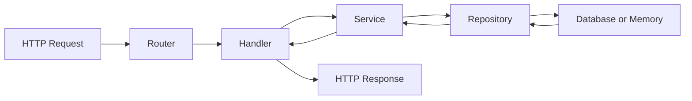

# 01: Web 服务的分层与目录组织

模块 08 里你已经能写 handler、路由和 JSON API,09 又会了数据库——但那些代码基本都堆在一两个文件里。这篇解决的问题是:**当接口从 3 个变成 30 个、还要连数据库时,代码放哪儿**。学完你能搭出"main 组装、handler 转协议、service 管规则、repository 管数据"的骨架,拿到别人的 Go Web 项目也知道从哪读起。

先给 Node 用户校准坐标:Express 项目常见 `routes/`、`controllers/`、`models/` 按**技术层**分目录;Go 社区更主流的做法是按**业务域**聚合——task 相关的 model、service、handler 都住在 `internal/task/` 一个包里。两种思路的差别本篇第 6 节会展开。

---

## 1. 一个推荐的最小结构

小型服务可以从这个结构开始(本模块 12 篇会一步步把它填满):

```text
task-api/
  go.mod
  cmd/
    task-api/
      main.go
  internal/
    config/
      config.go
    app/
      app.go
      routes.go
    httpx/
      json.go
      errors.go
      middleware.go
    task/
      model.go
      service.go
      repository.go
      handler.go
      memory_repository.go
```

每个目录职责一句话说清:

| 位置 | 职责 | Express 里的对应物 |
| --- | --- | --- |
| `cmd/task-api/main.go` | 程序入口:加载配置、组装依赖、启动服务 | `app.js` / `server.js` |
| `internal/config` | 环境变量、默认值、配置校验 | `dotenv` + config 模块 |
| `internal/app` | 应用组装、路由注册 | `app.use()` 那一堆 |
| `internal/httpx` | JSON 编解码、错误响应、中间件等 HTTP 通用工具 | 自己攒的 middleware/utils |
| `internal/task` | task 业务域的 model、service、repository、handler | routes+controllers+services+models 里 task 相关的碎片 |

两个 Go 特有的约定:

- **`cmd/<程序名>/`**:一个仓库可以编译出多个可执行文件(服务、迁移工具、CLI),每个占 `cmd/` 下一个子目录。
- **`internal/`**:这是编译器强制的私有边界——外部项目 `import` 你 `internal/` 下的包会**直接编译失败**。对比 JS:Node 没有语言级私有目录,包的"内部模块"只能靠约定或 `exports` 字段;Go 把这件事做成了硬规则。

**一句话总结:`cmd/` 放入口,`internal/` 放不给外人用的一切,业务代码按领域聚成包。**

---

## 2. 分层心智模型

请求从外到内流动,响应原路返回:



每一层只管自己能稳定负责的事:

| 层 | 职责 | 不该管的事 |
| --- | --- | --- |
| Router | 把方法+路径分配给 handler | 业务逻辑 |
| Handler | 读参数/body,调 service,写响应 | SQL、业务规则 |
| Service | 业务规则:状态流转、权限、重复检查 | `http.Request`、SQL 细节 |
| Repository | 保存和查询数据 | 业务规则 |

### 🕳️ 坑:handler 里什么都写

以为会怎样:把 SQL、校验、业务规则都写进 handler,反正能跑。
实际怎样:测试必须起 HTTP 服务器和真实数据库才能测一条业务规则;换存储要改所有 handler。
为什么:handler 同时绑定了 HTTP 协议和数据库两个"重依赖",业务规则被夹在中间,没法单独拎出来测。分层的全部目的就是让**业务规则不依赖协议和存储**。

反过来也一样:service 的函数签名里一旦出现 `http.Request`,它就只能被 HTTP 调用——以后想给它加 CLI 入口或定时任务入口都难。

---

## 3. main 只做组装

`main.go` 应该像一张**装配图**:看得到所有零件怎么接起来,但零件内部的事一概不管。

```go
func run() error {
    cfg, err := config.Load()                       // ① 加载配置
    if err != nil {
        return err
    }

    logger := slog.New(slog.NewTextHandler(os.Stdout, nil))
    repo := task.NewMemoryRepository()              // ② 创建依赖,由外向内
    service, err := task.NewService(repo, newID, time.Now)
    if err != nil {
        return err
    }

    application, err := app.New(app.Options{        // ③ 组装
        Config:      cfg,
        Logger:      logger,
        TaskService: service,
    })
    if err != nil {
        return err
    }
    return application.Run()                        // ④ 启动
}
```

这套骨架组装完真实跑起来是这样的(`ADDR=:19081 go run ./cmd/task-api` 后 curl 一次,再 Ctrl+C):

```text
time=2026-07-16T10:21:33.118-07:00 level=INFO msg="server listening" addr=:19081
time=2026-07-16T10:21:33.908-07:00 level=INFO msg="http request" method=GET path=/healthz status=200 bytes=16 duration=15.375µs request_id=e7d67ac80bc40c83710dd42f81d88307
time=2026-07-16T10:21:33.929-07:00 level=INFO msg="shutdown signal received"
time=2026-07-16T10:21:33.929-07:00 level=INFO msg="server stopped"
```

`config.Load`、`app.New`、`Run` 里面各是什么,分别是第 02、03、09 篇的内容。

**一句话总结:main 认识所有组件,但只做三件事——加载配置、创建依赖、启动关闭。**

---

## 4. 业务包内部怎么放

以 `internal/task` 为例,一个业务域一个包,包内按角色分文件:

```text
internal/task/
  model.go              // Task、Status 等领域类型
  service.go            // Create、List、Complete 等业务用例
  repository.go         // Repository 接口
  handler.go            // HTTP handler
  memory_repository.go  // 内存实现,适合开发和测试
  sql_repository.go     // 数据库实现,项目需要时再加
```

`model.go` 保存业务概念:

```go
type Status string

const (
    StatusOpen Status = "open"
    StatusDone Status = "done"
)

type Task struct {
    ID        string
    Title     string
    Status    Status
    CreatedAt time.Time
    UpdatedAt time.Time
}
```

`repository.go` 定义 service 需要的数据能力——注意它是**接口**:

```go
type Repository interface {
    Create(ctx context.Context, task Task) error
    FindByID(ctx context.Context, id string) (Task, error)
    List(ctx context.Context, filter ListFilter) ([]Task, error)
    Update(ctx context.Context, task Task) error
    Delete(ctx context.Context, id string) error
}
```

这里用上了模块 05 的原则:**接口放在使用方附近**。service 是 `Repository` 的使用者,所以接口就住在 task 包里;底层用内存、SQLite 还是 PostgreSQL,service 一概不关心。对比 JS:这相当于 TypeScript 里"消费方定义 interface,实现方 duck typing 对上就行"——Go 的接口隐式实现让这件事零成本。

---

## 5. Handler 依赖 Service

handler 是 HTTP 边界,它持有 service,但不创建 service:

```go
type HTTPHandler struct {
    service *Service
}

func NewHTTPHandler(service *Service) *HTTPHandler {
    return &HTTPHandler{service: service}
}
```

依赖从外部传进来(main 的装配图负责传),测试时就能传入测试替身——第 03 篇专门讲这个套路。

**一句话总结:每一层只"持有"下一层,不"创建"下一层。**

---

## 6. 常见结构误区

### 🕳️ 坑一:按技术层切得过碎

```text
controllers/
services/
repositories/
models/
```

以为会怎样:和 Express 项目一样整齐,分类清楚。
实际怎样:项目变大后,读懂"完成任务"这一个功能要在四个目录之间来回跳;`task`、`user`、`order` 的文件全搅在一起。
为什么:这种切法按"代码是什么角色"分类,而人读代码是按"功能"读的。业务型项目更适合按领域聚合,让一个功能的大部分代码物理上靠近。

### 🕳️ 坑二:所有公共代码扔进 utils

`utils`(或 `common`、`helpers`)会变成杂物箱,最后谁也不知道里面有什么。按**能力**命名:`httpx`(HTTP 工具)、`config`(配置)、`clock`(时间抽象)、`idgen`(ID 生成)。

### 🕳️ 坑三:过早抽象

repository 值得一开始就定义接口——它注定要被内存实现、数据库实现、测试实现轮流替换。但一个 service 只有一个实现时,不必为它再套一层接口。**先有第二个实现的需求,再抽接口。**

---

## 7. 拿到一个 Go Web 项目怎么读

按这个顺序检查,几分钟就能判断项目结构是否健康:

1. 入口文件在哪里(找 `cmd/` 或 `main.go`)。
2. 配置从哪里读取。
3. 路由在哪里注册。
4. handler 如何拿到依赖。
5. 业务规则在哪一层。
6. 数据访问是否被 repository 隔离。
7. 错误在哪里映射成 HTTP 状态码。
8. 测试是否能绕开真实网络和真实数据库。

这些问题答不上来的项目,改起来通常也很痛苦。这 8 个问题正好对应本模块后面的 11 篇。

---

## 本篇重点

- [ ] `cmd/` 放程序入口,`internal/` 是编译器强制的私有边界(Node 没有对应物,Go 直接拒绝外部导入)。
- [ ] 分层:Router 分配请求 → Handler 转协议 → Service 管业务规则 → Repository 管数据;每层只持有下一层,不创建下一层。
- [ ] main 是装配图:加载配置、创建依赖、启动关闭,不写业务细节。
- [ ] 按业务域聚合(`internal/task/`)优于按技术层切碎(`controllers/`、`services/`);接口放在使用方附近。
- [ ] repository 从一开始就用接口隔离;service 只有一个实现时别急着抽接口。

---

## 练习

为一个图书借阅服务 `book-api` 搭出目录骨架:

要求:

1. 按第 1 节的结构建目录:`cmd/book-api`、`internal/config`、`internal/app`、`internal/httpx`、`internal/book`。
2. `internal/book` 里创建 `model.go`(定义 `Book` 结构体和 `Status` 类型)和 `repository.go`(定义 `Repository` 接口,至少含 `Create`、`FindByID`、`List`)。
3. `main.go` 里先只打印一行启动日志,保证 `go build ./...` 通过。
4. 回答:如果另一个仓库想 `import` 你的 `internal/book` 包,会发生什么?动手试一下。

提示:接口方法的第一个参数统一是 `context.Context`(模块 06 第 07 篇讲过为什么);`go mod init` 的模块名可以用 `example.com/book-api`。
