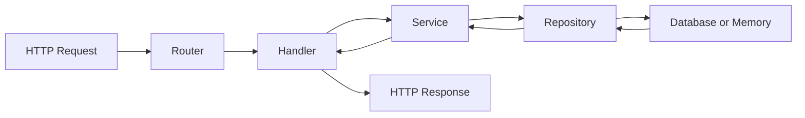

# Web 服务的分层与目录组织

Web 服务比单个 handler 多了几个问题：服务如何启动，依赖如何传递，业务规则放在哪里，数据库访问如何隔离，错误如何统一返回，测试怎样绕开真实网络和真实数据库。

这一篇先建立整体结构。

---

## 1. 一个推荐的最小结构

小型服务可以从这个结构开始：

```text
task-api/
  go.mod
  cmd/
    task-api/
      main.go
  internal/
    config/
      config.go
    app/
      app.go
      routes.go
    httpx/
      json.go
      errors.go
      middleware.go
    task/
      model.go
      service.go
      repository.go
      handler.go
      memory_repository.go
```

每个目录都有清楚职责：

| 位置 | 职责 |
| --- | --- |
| `cmd/task-api/main.go` | 程序入口，加载配置、组装依赖、启动服务 |
| `internal/config` | 环境变量、默认值、配置校验 |
| `internal/app` | 应用组装、路由注册、服务器需要的顶层依赖 |
| `internal/httpx` | JSON 编解码、错误响应、中间件等 HTTP 通用工具 |
| `internal/task` | task 这个业务域的 model、service、repository、handler |

`internal` 的作用是限制包的导入范围。外部项目不能直接导入 `internal` 下的包，这很适合业务服务。

---

## 2. 分层心智模型

请求从外到内流动，响应从内到外返回：



每一层只处理自己能稳定负责的事情：

- Router：匹配路径和方法。
- Handler：读取路径参数、query、body，调用 service，写响应。
- Service：处理业务规则，例如状态流转、权限校验、重复检查。
- Repository：保存和查询数据。
- Database：真正的数据存储。

handler 中出现大量 SQL、事务、业务规则时，后续测试和修改都会变重。service 直接使用 `http.Request` 或 `http.ResponseWriter` 时，业务代码会被 HTTP 协议绑定住。

---

## 3. main 只做组装

`main.go` 应该像一张装配图：

```go
package main

import (
	"log"
	"os"

	"example.com/task-api/internal/app"
	"example.com/task-api/internal/config"
	"example.com/task-api/internal/task"
)

func main() {
	cfg, err := config.Load()
	if err != nil {
		log.Fatalf("load config: %v", err)
	}

	logger := app.NewLogger(os.Stdout, cfg.LogLevel)
	repo := task.NewMemoryRepository()
	service := task.NewService(repo)

	application, err := app.New(app.Options{
		Config:      cfg,
		Logger:      logger,
		TaskService: service,
	})
	if err != nil {
		log.Fatalf("new app: %v", err)
	}

	if err := application.Run(); err != nil {
		log.Fatalf("run app: %v", err)
	}
}
```

入口文件可以知道所有组件，但不要承载业务细节。它适合做三件事：

1. 加载配置。
2. 创建依赖。
3. 启动和关闭服务。

---

## 4. 业务包内部怎么放

以 `internal/task` 为例：

```text
internal/task/
  model.go              // Task、Status 等领域类型
  service.go            // Create、List、Complete 等业务用例
  repository.go         // Repository 接口
  handler.go            // HTTP handler
  memory_repository.go  // 内存实现，适合开发和测试
  sql_repository.go     // 数据库实现，项目需要时再加
```

`model.go` 保存业务概念：

```go
package task

import "time"

type Status string

const (
	StatusOpen Status = "open"
	StatusDone Status = "done"
)

type Task struct {
	ID        string
	Title     string
	Status    Status
	CreatedAt time.Time
	UpdatedAt time.Time
}
```

`repository.go` 定义 service 需要的数据能力：

```go
package task

import "context"

type Repository interface {
	Create(ctx context.Context, task Task) error
	FindByID(ctx context.Context, id string) (Task, error)
	List(ctx context.Context) ([]Task, error)
	Update(ctx context.Context, task Task) error
	Delete(ctx context.Context, id string) error
}
```

接口放在使用方附近。service 使用这个接口，所以接口可以放在业务包里。这样 service 不关心底层用内存、SQLite、PostgreSQL 还是远程 API。

---

## 5. Handler 依赖 Service

handler 是 HTTP 边界：

```go
package task

type HTTPHandler struct {
	service *Service
}

func NewHTTPHandler(service *Service) *HTTPHandler {
	return &HTTPHandler{service: service}
}
```

handler 不直接创建 service，也不直接创建 repository。依赖从外部传进来，测试时就可以传入测试替身。

---

## 6. 常见结构误区

### 6.1 按技术层切得过碎

这种结构看起来整齐：

```text
controllers/
services/
repositories/
models/
```

项目变大后，`task`、`user`、`order` 的文件会分散在四个目录里。阅读一个功能需要来回跳。业务型项目更适合按领域聚合，让一个功能的大部分代码靠近。

### 6.2 把所有公共代码放进 utils

`utils` 容易变成杂物箱。更好的命名方式是按能力命名：

- `httpx`：HTTP 工具。
- `config`：配置读取。
- `clock`：时间抽象。
- `idgen`：ID 生成。

### 6.3 过早抽象

一个 service 只有一个实现时，不一定需要为 service 再定义接口。repository 往往需要接口，因为它经常要被内存实现、数据库实现、测试实现替换。

---

## 7. 学习检查

读一个 Go Web 项目时，可以按这个顺序检查：

1. 入口文件在哪里。
2. 配置从哪里读取。
3. 路由在哪里注册。
4. handler 如何拿到依赖。
5. 业务规则在哪一层。
6. 数据访问是否被 repository 隔离。
7. 错误在哪里映射成 HTTP 状态码。
8. 测试是否能绕开真实网络和真实数据库。

如果这些问题能快速回答，项目结构通常比较健康。
