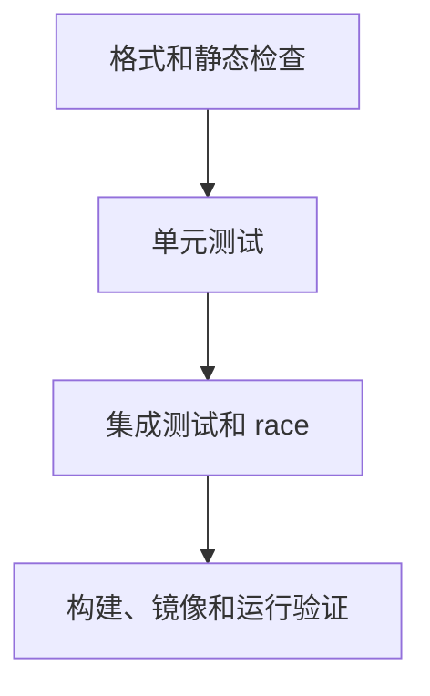

# 工程化与验证的心智模型

工程化的目标是让项目在多人协作、频繁修改和长期维护中仍然可靠。验证的目标是让问题尽早暴露，并且暴露得足够清楚。

---

## 1. Go 项目的验证链路

一个基础 Go 项目至少应该能稳定跑完：

```bash
go fmt ./...
go vet ./...
go test ./...
go test -race ./...
go build ./...
```

这些命令解决的问题不同：

| 命令 | 主要作用 |
| --- | --- |
| `go fmt ./...` | 统一格式，减少无意义风格争论 |
| `go vet ./...` | 检查可疑代码，例如格式化参数错误、锁复制等 |
| `go test ./...` | 运行测试，验证行为 |
| `go test -race ./...` | 检查并发数据竞争 |
| `go build ./...` | 确认所有包可以编译 |

验证链路应该越早越快。开发时本地跑，提交前完整跑，合并前 CI 跑。

---

## 2. 验证分层

可以把验证分成四层：



每层关注不同风险：

- 格式和静态检查：代码有没有明显低级问题。
- 单元测试：函数、类型和业务规则是否符合预期。
- 集成测试：多个组件连接起来是否还能工作。
- 构建运行：产物能否启动、配置是否有效、接口能否被调用。

不要把所有验证都压到最后一层。越晚发现问题，定位成本越高。

---

## 3. 工程化不是复杂目录

很多项目会过早引入复杂结构：

```text
controllers/
services/
managers/
providers/
helpers/
utils/
```

目录多不代表工程化好。更重要的问题是：

1. 一个包的职责能否一句话说清。
2. 依赖方向是否清楚。
3. 业务规则是否能被单独测试。
4. 外部资源是否能在测试中替换。
5. 常用命令是否能一键运行。
6. CI 是否能重复本地验证。

工程化首先是降低理解成本和验证成本。

---

## 4. 项目级验证清单

每次完成一个功能，可以按这个顺序检查：

1. 代码是否通过 `go fmt ./...`。
2. 是否通过 `go vet ./...`。
3. 是否有测试覆盖正常路径。
4. 是否有测试覆盖错误路径。
5. 如果涉及并发，是否通过 `go test -race ./...`。
6. 如果涉及 HTTP，是否用 `httptest` 或 `curl` 验证接口。
7. 如果涉及数据库，是否覆盖约束、事务和没查到数据。
8. 是否能 `go build ./...`。
9. 日志是否能帮助定位失败。
10. README 或运行说明是否需要更新。

这份清单会逼你从“写完代码”转向“验证代码”。

---

## 5. 验证结果要可复现

可复现意味着别人能用同样命令得到同样结果：

```bash
make check
```

背后可以串起：

```makefile
.PHONY: check
check: fmt vet test race build
```

如果一个项目只有你知道怎么跑，项目就很脆弱。命令应该写进 Makefile、README 或 CI。

---

## 6. 快速反馈和完整反馈

开发时可以跑快速命令：

```bash
go test ./internal/task
```

提交前跑完整命令：

```bash
go test ./...
go test -race ./...
go build ./...
```

快速反馈让你保持节奏，完整反馈负责守住边界。两者都需要。

---

## 7. 学习检查

看一个 Go 项目是否具备基本工程化能力，可以问：

1. 新人能否在 10 分钟内跑起测试。
2. 常用命令是否写在一个地方。
3. CI 是否覆盖本地关键命令。
4. 测试失败时是否容易定位。
5. 依赖版本是否可复现。
6. 构建产物是否带版本信息。
7. 线上问题是否能靠日志缩小范围。
